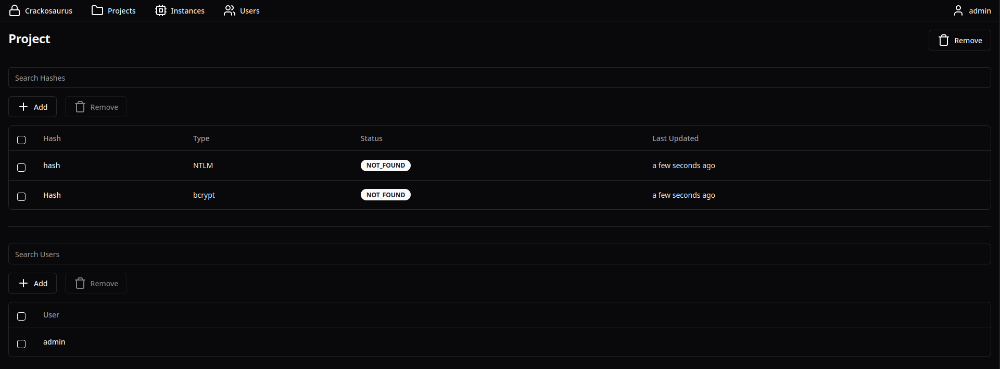

# 🦖 Crackosaurus

Crackosaurus is the world's first open source password recovery platform. Powered by [hashcat](https://hashcat.net/hashcat/), Crackosaurus can recover almost any type of password hash with great speed and ease. Crackosaurus is a must have tool for any security team!



## 📦 Deployment

Crackosaurus is designed to be deployable anywhere. Find your favorite infrastructure below. If it's not there, PRs are open!

### ☁️ AWS CDK

AWS CDK is recommended to deploy on the cloud.

It is strongly recommended to make a [private fork](https://gist.github.com/0xjac/85097472043b697ab57ba1b1c7530274) of this repository. Make a branch `YOUR_ORG` and copy `apps/cdk/lib/cdk-stack.ts` to `apps/cdk/lib/YOUR_ORG-stack.ts` and update `apps/cdk/bin/cdk.ts` to point to your new stack. This will allow to tweak the infrastructure settings.

#### Dependencies

- [Docker](https://www.docker.com/)
- [Node](https://nodejs.org/en)
- [NPM](https://www.npmjs.com/)

For Docker, make sure that the deployment user is part of the `docker` group:

```
sudo usermod -aG docker YOUR_USERNAME
```

#### Deploy

```
npm install
cd apps/cdk
AWS_PROFILE=YOUR_PROFILE npm run cdk bootstrap
AWS_PROFILE=YOUR_PROFILE npm run cdk deploy
```

Setup the platform using:

```
http://LINK_TO_APP/setup
```

Note: run the deploy step function once the containers are running.

#### Infrastructure


### 🐋 Docker

Docker is recommended to deploy locally.

#### Dependencies

- [Docker](https://www.docker.com/)
- [Docker Compose](https://docs.docker.com/compose/)
- [CUDA](https://developer.nvidia.com/cuda-toolkit)

#### Deploy

```
sudo docker-compose build
sudo docker-compose up
```

Setup the platform using:

```
http://localhost:8080/setup
```

Note: if the instance fails, update the `nvidia/cuda` container version in the [instance Containerfile](packages/container/instance/docker/Containerfile) to match the system CUDA version.

## 🔨 Development

### 🔗 PR

Development of the app is done via [feature branches](https://www.atlassian.com/git/tutorials/comparing-workflows/feature-branch-workflow) off the current version branch. Make sure to have this configured before continuing.

### 🧩 Dependencies

Crackosaurus is a full TypeScript Monorepo. The following is required:

- [Node](https://nodejs.org/en)
- [NPM](https://www.npmjs.com/)

The following is only necessary for deployment:

- [Docker](https://www.docker.com/)
- [Docker Compose](https://docs.docker.com/compose/)

### 🔍 Checks

Checks are required before PR. This can easily be done on all the monorepo using:

```
npm install
npm run format
npm run lint
```

### 🖥️ Setup

[Prisma](https://www.prisma.io/) is the ORM used to handle the database. This can be setup and updated using following:

```
npm install
npm run migrate
```

### 👣 Run

The admin account can be setup using:

http://localhost:5174/setup

The microservices can be found at:

- Web: http://localhost:5174/
- Backend: http://localhost:8080/
- Cluster: http://localhost:13337/

#### ⚙️ Debug

This is a dummy cluster that prints API commands.

```
npm run dev
```

## 🐛 Bugs

Following are a list of known bugs with their fixes.

### Server/cluster hangs on requests

This is most likely due to a `.lock` file not being removed. You can manually remove them from the data folder.
