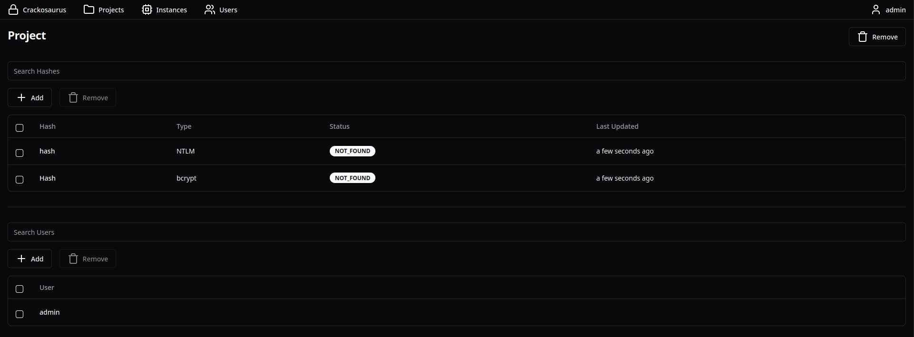
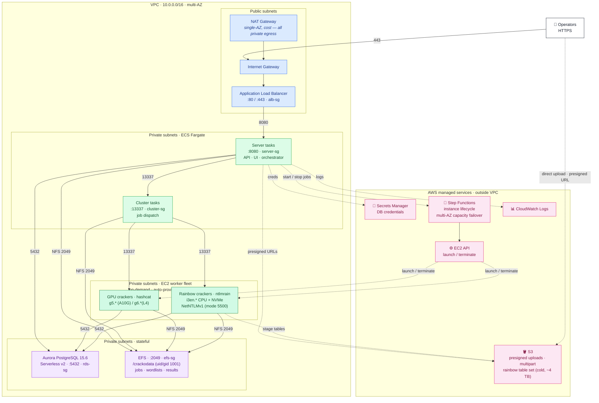

# 🦖 Crackosaurus

> ⚠️ **BETA SOFTWARE** — Fully functional, but under active development. Expect occasional bugs and breaking changes between versions.

> 📖 **Open source (MIT).** Free to use, study, modify, and deploy — including commercially. See [License](#-license).

Crackosaurus is a self-hosted password-recovery platform. Powered by [hashcat](https://hashcat.net/hashcat/), it recovers almost any hash type at scale using **distributed GPU cracking on AWS** — plus a built-in **self-hosted NetNTLMv1 rainbow-table capability** that recovers challenge/response captures on CPU with no wordlist and no GPU. Everything runs inside your own AWS account: captures and credentials never leave your control.



## ✨ Features

- **Distributed GPU cracking** — on-demand AWS GPU instances (g5 / g6, i.e. NVIDIA A10G / L4), auto-provisioned per approved job
- **🌈 NetNTLMv1 rainbow recovery** — a self-hosted "private crack.sh": recover NetNTLMv1 (hashcat mode `5500`) captures from precomputed rainbow tables on a CPU instance, no GPU or wordlist needed. See [NetNTLMv1 Rainbow Recovery](#-netntlmv1-rainbow-recovery)
- **Multi-AZ failover** — GPU instance lifecycle managed by Step Functions with automatic cross-AZ retry on capacity errors
- **All hash types** — every hashcat mode, with automatic hash-type detection from structural prefixes/patterns on add
- **Cascades** — multi-step job templates that chain attack modes (wordlist → rules → mask) and run sequentially
- **Hash shucking** — extracts inner NT hashes from composite formats (NTLMv1/v2, DCC, DCC2, Kerberos 5, …) so the simpler NTLM cracks first
- **Recovered-hash corpus** — every recovered NT hash is retained as a permanent, project-spanning known-hash corpus for instant pass-the-hash reuse
- **Mask presets** — dropdown of common mask patterns for quick brute-force setup
- **Role-based access** — job-approval workflow with granular permissions
- **Large file support** — direct S3 multipart uploads for wordlists and rules
- **EFS-based coordination** — job state managed via a shared filesystem; simple and reliable
- **Auto-scaling / auto-shutdown** — instances start on approval and shut down after 60s idle

## 🌈 NetNTLMv1 Rainbow Recovery

Crackosaurus ships a **self-hosted rainbow-table capability for NetNTLMv1** — the same idea as the public crack.sh service, but running entirely inside your own AWS account. It turns a captured NetNTLMv1 challenge/response into the account's NT hash **without brute force, a GPU, or a wordlist**.

### How it works

1. **Submit** a NetNTLMv1 hash (hashcat mode `5500`) to a project like any other hash.
2. **Launch → approve** through the normal flow. The server detects mode `5500` and **auto-pins a CPU rainbow instance** — you don't pick an instance type or wordlist; the Launch UI hides those controls and shows a rainbow badge instead.
3. The orchestrator provisions an **on-demand `i3en.12xlarge`** (48 vCPU; fallbacks: `i3en.6xlarge`, `i3en.3xlarge`, `i3en.2xlarge`), which **stages the rainbow table set from S3 to local NVMe** on boot. The lookup is CPU-bound and parallel, so cores drive wall-clock time; i3en pricing is flat per vCPU, so a bigger box costs the same per hash and just finishes sooner.
4. The worker runs the lookup, writes the recovered NT hash back to EFS, and the hash flips to **`FOUND` with `source = RAINBOW`**.

The operator selects nothing rainbow-specific — the server pins the instance type, nulls wordlist/rule/mask, and forces dictionary mode automatically for any `5500` job.

### The table set (GRTB)

- **~4 TB** precomputed table set (4096 shards + a global index), stored **cold on S3** (~$100/mo) and staged to instance-store NVMe only while a crack runs.
- crack.sh-style tables keyed to the **fixed server challenge `1122334455667788`** — only captures using that challenge are recoverable.
- Coverage ≈ **99.88%** naive union (≈ 94.7% realistic single-table), so a small fraction of hashes won't recover even with the full set.
- Cracker: **[ntlmrain](https://github.com/outflanknl/ntlmrain)** (Rust, CPU). On-demand `i3en.12xlarge` ≈ **$6.00/hr** (ca-central-1), running only during the crack.

### Capture format

NetNTLMv1 captures (e.g. from Responder or `ntlmrelayx`) are six colon-separated fields:

```
user::domain:LM_response:NT_response:server_challenge
```

- `NT_response` / `LM_response` — 48 hex chars each (24 bytes)
- `server_challenge` — 16 hex chars (8 bytes); must be `1122334455667788` to be table-recoverable

### Ingestion API (machine-to-machine)

An out-of-band cracking runner can feed results back in via the **`rainbow` router** — a machine-only endpoint gated by an `Authorization: Bearer <service-secret>` (no browser session can reach it):

- `rainbow.listUnresolved` — distinct unresolved `5500` captures across all projects
- `rainbow.resolve` — submit a recovered NT hash for a capture

`resolve` is **anti-poison**: it recomputes the NetNTLMv1 response from the submitted NT hash (pure-JS DES) and refuses to mark `FOUND` unless it cryptographically reproduces the capture. This guards the permanent known-hash corpus against garbage writes. Confirmed hashes also fork into a mode-`1000` (NTLM) known hash for pass-the-hash reuse.

## 📦 Deployment

Two deployment methods are supported.

### ☁️ AWS CDK

Production-ready infrastructure:

- **VPC** with multi-AZ high availability
- **RDS PostgreSQL 16** with automated backups and Secrets Manager
- **ECS Fargate** for the server + cluster services
- **EC2 GPU instances** (g5 / g6) auto-provisioned via Step Functions
- **EC2 rainbow instances** (`i3en.*`, CPU) auto-provisioned for NetNTLMv1 `5500` jobs
- **EFS** for shared storage and job coordination
- **Application Load Balancer** with health checks
- **Auto-scaling** in production (2–10 tasks based on CPU)
- **S3** with presigned URLs for large uploads (wordlists, rules, results) and cold storage of the rainbow table set
- **Step Functions** for instance lifecycle with multi-AZ capacity failover
- **IAM roles** with least-privilege permissions
- **CloudWatch Logs** for monitoring
- **Service Discovery** for inter-service communication

#### Network Architecture


```mermaid
flowchart TB
    op["👤 Operators<br/>HTTPS"]

    subgraph VPC["VPC · 10.0.0.0/16 · multi-AZ"]
        subgraph PUB["Public subnets"]
            igw["Internet Gateway"]
            nat["NAT Gateway<br/><i>single-AZ, cost — all private egress</i>"]
            alb["Application Load Balancer<br/>:80 / :443 · alb-sg"]
        end

        subgraph ECS["Private subnets · ECS Fargate"]
            server["Server tasks<br/>:8080 · server-sg<br/>API · UI · orchestrator"]
            cluster["Cluster tasks<br/>:13337 · cluster-sg<br/>job dispatch"]
        end

        subgraph FLEET["Private subnets · EC2 worker fleet<br/>on-demand · auto-provisioned across AZ a · b · d"]
            gpu["GPU crackers · hashcat<br/>g5.* (A10G) / g6.*(L4)"]
            rainbow["Rainbow crackers · ntlmrain<br/>i3en.* CPU + NVMe<br/>NetNTLMv1 (mode 5500)"]
        end

        subgraph STATE["Private subnets · stateful"]
            db["Aurora PostgreSQL 15.6<br/>Serverless v2 · :5432 · rds-sg"]
            efs["EFS · :2049 · efs-sg<br/>/crackodata (uid/gid 1001)<br/>jobs · wordlists · results"]
        end
    end

    subgraph AWS["AWS managed services · outside VPC"]
        sm["🔑 Secrets Manager<br/>DB credentials"]
        s3["🪣 S3<br/>presigned uploads · multipart<br/>rainbow table set (cold, ~4 TB)"]
        sfn["🔀 Step Functions<br/>instance lifecycle<br/>multi-AZ capacity failover"]
        ec2api["⚙️ EC2 API<br/>launch / terminate"]
        cw["📊 CloudWatch Logs"]
    end

    %% request path
    op -->|443| igw --> alb -->|8080| server -->|13337| cluster
    cluster -->|13337| gpu
    cluster -->|13337| rainbow

    %% shared state
    server -->|5432| db
    gpu -->|5432| db
    rainbow -->|5432| db
    server -->|NFS 2049| efs
    cluster -->|NFS 2049| efs
    gpu -->|NFS 2049| efs
    rainbow -->|NFS 2049| efs

    %% egress + external (logical; physically via NAT)
    nat --> igw
    server -.->|creds| sm
    server -.->|presigned URLs| s3
    rainbow -.->|stage tables| s3
    server -.->|start / stop jobs| sfn
    sfn --> ec2api
    ec2api -.->|launch / terminate| gpu
    ec2api -.->|launch / terminate| rainbow
    server -.->|logs| cw
    op -.->|direct upload · presigned URL| s3

    classDef net fill:#dbeafe,stroke:#2563eb,color:#1e3a8a;
    classDef ecs fill:#dcfce7,stroke:#16a34a,color:#14532d;
    classDef ec2 fill:#d1fae5,stroke:#15803d,color:#14532d;
    classDef data fill:#f3e8ff,stroke:#9333ea,color:#581c87;
    classDef ext fill:#fce7f3,stroke:#db2777,color:#831843;
    classDef user fill:#ffffff,stroke:#111827,color:#111827;

    class igw,nat,alb net;
    class server,cluster ecs;
    class gpu,rainbow ec2;
    class db,efs data;
    class sm,s3,sfn,ec2api,cw ext;
    class op user;
```

<sub>Solid = in-VPC data path (port labelled) · dashed = control plane & AWS-service access (egress via the NAT gateway). GPU and rainbow workers are launched on demand by Step Functions and self-terminate when idle.</sub>

#### Quick Start

**Prerequisites:** AWS CLI configured with credentials · Docker running locally · Node.js 20+

```powershell
# 1. Bootstrap CDK (once per account/region)
cd apps/cdk
npx cdk bootstrap

# 2. Deploy the stack (builds and pushes images automatically)
cd ..\..
.\scripts\deploy.ps1 dev
```

**Environments:**

- `dev` — cost-optimized (db.t3.micro, 1 task) — ~$100/month + compute
- `bleeding` — bleeding-edge test environment
- Custom — edit `apps/cdk/config/` for your needs

**💰 Cost warning:** Compute is billed on-demand. A GPU `g5.xlarge` ≈ $1/hr; a rainbow `i3en.12xlarge` ≈ $6/hr; the rainbow table set ≈ $100/month cold on S3. GPU/rainbow instances shut down after 60 seconds idle — monitor usage.

**Access:** the ALB DNS is in the CloudFormation outputs. Open it and complete the setup wizard at `/setup`.

#### Deployment Scripts

```powershell
# Deploy to an environment
.\scripts\deploy.ps1 <environment>     # e.g. dev, bleeding

# Destroy a stack (from the CDK directory)
cd apps/cdk
npx cdk destroy Crackosaurus-dev
```

#### Monitoring

```powershell
# CloudWatch logs
aws logs tail /aws/ecs/crackosaurus-dev-server --follow
aws logs tail /aws/ecs/crackosaurus-dev-cluster --follow

# Running instances (GPU + rainbow)
aws ec2 describe-instances \
  --filters 'Name=tag:ManagedBy,Values=Crackosaurus' 'Name=instance-state-name,Values=running' \
  --query 'Reservations[].Instances[].{ID:InstanceId,Type:InstanceType,State:State.Name}' --output table

# Costs (adjust the time period)
aws ce get-cost-and-usage --time-period Start=2026-09-01,End=2026-09-30 \
  --granularity MONTHLY --metrics BlendedCost \
  --group-by Type=DIMENSION,Key=SERVICE --output table
```

### 🐋 Docker

Recommended for running locally.

**Dependencies:** [Docker](https://www.docker.com/) · [Docker Compose](https://docs.docker.com/compose/) · [CUDA](https://developer.nvidia.com/cuda-toolkit) (for local GPU cracking)

First, provide the local secrets. The cluster refuses to start without `CLUSTER_SECRET` (security hardening), so copy the template — Docker Compose auto-loads `.env`:

```
cp .env.example .env
```

`.env` is gitignored; the checked-in `.env.example` holds placeholder dev values you can edit. Then build and start the stack:

```
sudo docker-compose build
sudo docker-compose up
```

Then open `http://localhost:8080/setup` to create the admin account.

> If the instance container fails, update the `nvidia/cuda` version in the [instance Containerfile](packages/container/instance/docker/Containerfile) to match your system CUDA version.

## 🔨 Development

Crackosaurus is a full-TypeScript monorepo.

### 🧩 Dependencies

- [Node.js](https://nodejs.org/en) 20+ · [NPM](https://www.npmjs.com/) 10+
- For deployment only: [Docker](https://www.docker.com/) · [Docker Compose](https://docs.docker.com/compose/)

### 🔗 PR

Development happens on [feature branches](https://www.atlassian.com/git/tutorials/comparing-workflows/feature-branch-workflow) off the current version branch. Configure this before starting.

### 🔍 Checks

Required before a PR — run across the whole monorepo:

```
npm install
npm run format
npm run lint
```

### 🖥️ Setup

[Prisma](https://www.prisma.io/) is the ORM. Set up / migrate the database:

```
npm install
npm run migrate
```

### 👣 Run

```
npm run dev
```

Services:

- Web: `http://localhost:5174/` (create the admin account at `/setup`)
- Backend: `http://localhost:8080/`
- Cluster: `http://localhost:13337/`

> In production, the backend serves the built web bundle on the same port (`8080/setup`). In local dev, the web app runs separately on `5174`.

#### ⚙️ Debug

`npm run dev` uses a dummy cluster that prints API commands instead of launching real infrastructure.

## 🐛 Bugs

Known issues and fixes.

### Server/cluster hangs on requests

Usually a stale `.lock` file. Remove it manually from the data folder.

### Instance status not updating on the instance page

The instance details page can show "Pending" while the project page updates correctly. UI-only — the instance is functioning.

## 📄 License

Crackosaurus is released under the **[MIT License](LICENSE)** — free to use, copy, modify, and distribute for any purpose, including commercial use. See the [`LICENSE`](LICENSE) file for the full terms.
