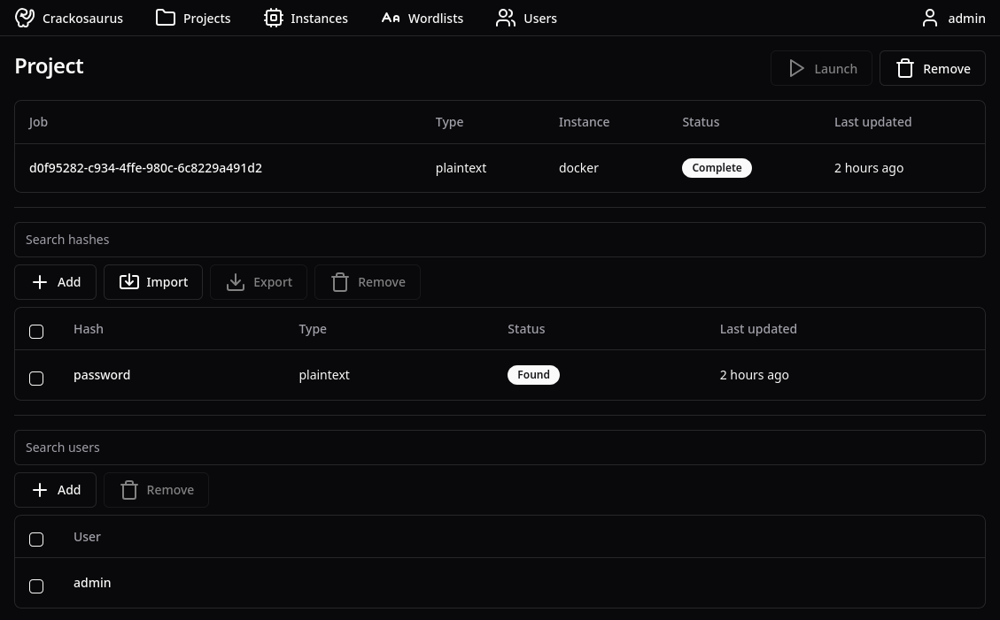

# 🦖 Crackosaurus

> ⚠️ **BETA SOFTWARE** - This is beta software under active development. While fully functional, expect occasional bugs and breaking changes between versions.

Crackosaurus is the world's first open source password recovery platform. Powered by [hashcat](https://hashcat.net/hashcat/), Crackosaurus can recover almost any type of password hash with great speed and ease using distributed GPU-accelerated computing on AWS. Crackosaurus is a must-have tool for any security team!



## ✨ Features

- **Distributed GPU Cracking** - Automatically spin up AWS GPU instances (g3, g4, g5, p3, p4, p5) on-demand
- **Multi-AZ Support** - Automatic failover across availability zones for maximum reliability
- **All Hash Types** - Support for all hashcat hash modes
- **Role-Based Access** - Job approval system with granular permissions
- **Large File Support** - Direct S3 multipart uploads for wordlists and rules files
- **EFS-Based Coordination** - Simple, reliable job state management via shared filesystem
- **Auto-Scaling** - GPU instances automatically start when jobs are approved and shut down after 60s idle

## 📦 Deployment

Crackosaurus currently supports two deployment methods:

### ☁️ AWS CDK

AWS CDK deployment provides a complete, production-ready infrastructure with:

- **VPC** with multi-AZ high availability
- **RDS PostgreSQL 16** with automated backups and secrets management
- **ECS Fargate** for serverless container deployment (server + cluster)
- **EC2 GPU Instances** (g3/g4/g5/p3/p4/p5) with automatic provisioning via Step Functions
- **EFS** for shared storage and job coordination between services
- **Application Load Balancer** with health checks
- **Auto-scaling** in production (2-10 tasks based on CPU)
- **S3** with presigned URLs for large file uploads (wordlists, rules, results)
- **Step Functions** for GPU instance lifecycle management with multi-AZ failover
- **IAM roles** with least-privilege permissions
- **CloudWatch Logs** for comprehensive monitoring
- **Service Discovery** for inter-service communication

#### Network Architecture


For detailed network architecture including security groups and data flows, see [docs/NETWORK_ARCHITECTURE.md](docs/NETWORK_ARCHITECTURE.md).

#### Quick Start

See [apps/cdk/DEPLOYMENT.md](apps/cdk/DEPLOYMENT.md) for comprehensive instructions.

**Prerequisites:**

- AWS CLI configured with credentials
- Docker running locally
- Node.js 18+

**Deploy in 2 steps:**

```powershell
# 1. Bootstrap CDK (once per account/region)
cd apps/cdk
npx cdk bootstrap

# 2. Deploy the stack (builds and pushes images automatically)
cd ..\..
.\scripts\deploy.ps1 dev
```

**Environment Options:**

- `dev`: Cost-optimized (db.t3.micro, 1 task) - ~$100/month + GPU costs
- `bleeding`: Bleeding edge test environment
- Custom: Modify `apps/cdk/config/` for your needs

**💰 Cost Warning:** GPU instances are expensive! A g5.xlarge costs ~$1/hour. Jobs are processed quickly, but monitor your usage. Instances automatically shut down after 60 seconds of idle time.

**Access your deployment:**
The Application Load Balancer DNS will be in the CloudFormation outputs. Navigate to it in your browser and complete the setup wizard at `/setup`.

#### Deployment Scripts

```powershell
# Deploy to an environment
.\scripts\deploy.ps1 <environment>

# Examples
.\scripts\deploy.ps1 dev
.\scripts\deploy.ps1 bleeding

# Destroy stack (from CDK directory)
cd apps/cdk
npx cdk destroy Crackosaurus-dev
```

#### Monitoring

```powershell
# View CloudWatch logs
aws logs tail /aws/ecs/crackosaurus-dev-server --follow
aws logs tail /aws/ecs/crackosaurus-dev-cluster --follow

# List running GPU instances
aws ec2 describe-instances --filters 'Name=tag:ManagedBy,Values=Crackosaurus' 'Name=instance-state-name,Values=running' --query 'Reservations[].Instances[].{ID:InstanceId,Type:InstanceType,State:State.Name}' --output table

# Check costs
aws ce get-cost-and-usage --time-period Start=2025-11-01,End=2025-11-14 --granularity MONTHLY --metrics BlendedCost --group-by Type=DIMENSION,Key=SERVICE --output table
```

#### Documentation

- **[DEPLOYMENT.md](apps/cdk/DEPLOYMENT.md)** - Complete deployment guide
- **[README.md](apps/cdk/README.md)** - Quick reference and architecture

#### Key Features

- **GPU Instance Types**: g3, g4, g5, p3, p4, p5 instances supported
- **Automatic Failover**: Multi-AZ support via Step Functions
- **No manual S3 setup**: Buckets auto-created with `crackosaurus-{random}` naming
- **Secure by default**: Secrets Manager for passwords, IAM roles for authentication
- **Production-ready**: Auto-scaling, multi-AZ, EFS for reliability
- **Cost-optimized**: Single NAT Gateway, 60-second instance cooldown
- **EFS-based coordination**: Shared filesystem for reliable job state management

### 🐋 Docker

Docker is recommended to deploy locally.

#### Dependencies

- [Docker](https://www.docker.com/)
- [Docker Compose](https://docs.docker.com/compose/)
- [CUDA](https://developer.nvidia.com/cuda-toolkit)

#### Deploy

```
sudo docker-compose build
sudo docker-compose up
```

Setup the platform using:

```
http://localhost:8080/setup
```

Note: if the instance fails, update the `nvidia/cuda` container version in the [instance Containerfile](packages/container/instance/docker/Containerfile) to match the system CUDA version.

## 🔨 Development

### 🔗 PR

Development of the app is done via [feature branches](https://www.atlassian.com/git/tutorials/comparing-workflows/feature-branch-workflow) off the current version branch. Make sure to have this configured before continuing.

### 🧩 Dependencies

Crackosaurus is a full TypeScript Monorepo. The following is required:

- [Node](https://nodejs.org/en)
- [NPM](https://www.npmjs.com/)

The following is only necessary for deployment:

- [Docker](https://www.docker.com/)
- [Docker Compose](https://docs.docker.com/compose/)

### 🔍 Checks

Checks are required before PR. This can easily be done on all the monorepo using:

```
npm install
npm run format
npm run lint
```

### 🖥️ Setup

[Prisma](https://www.prisma.io/) is the ORM used to handle the database. This can be setup and updated using following:

```
npm install
npm run migrate
```

### 👣 Run

The admin account can be setup using:

http://localhost:5174/setup

The microservices can be found at:

- Web: http://localhost:5174/
- Backend: http://localhost:8080/
- Cluster: http://localhost:13337/

#### ⚙️ Debug

This is a dummy cluster that prints API commands.

```
npm run dev
```

## 🐛 Bugs

Following are a list of known bugs with their fixes.

### Server/cluster hangs on requests

This is most likely due to a `.lock` file not being removed. You can manually remove them from the data folder.

### Instance status not updating on instance page

The instance status shows "Pending" on the instance details page but correctly updates on the project page. This is a UI issue only - instances are functioning correctly.
